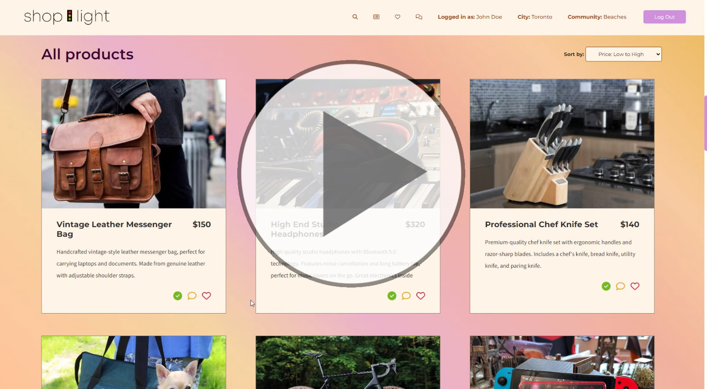
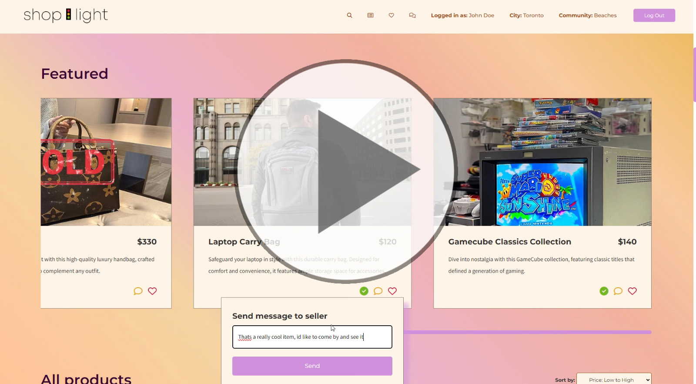
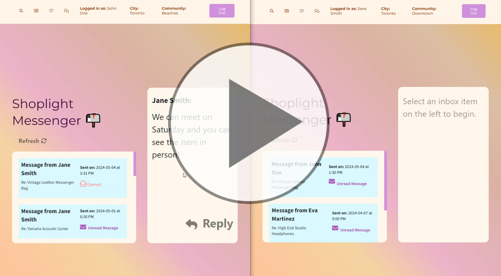
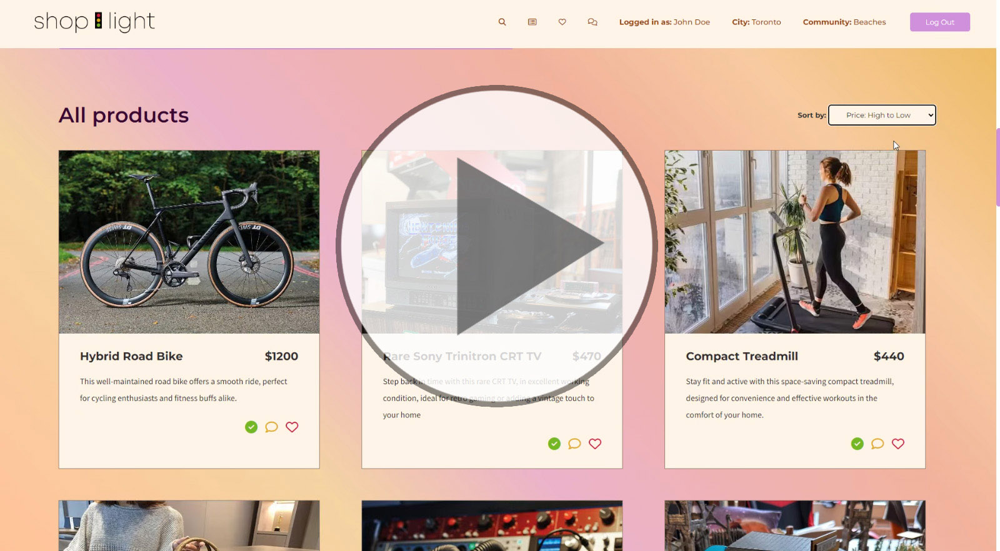
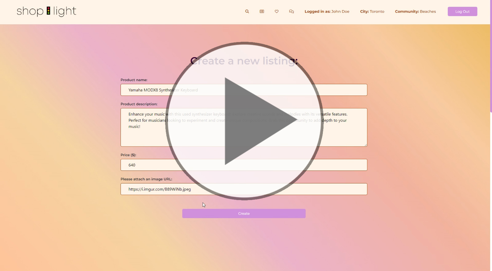
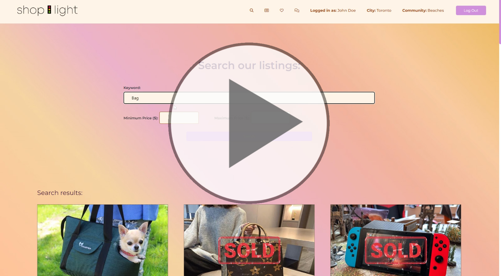
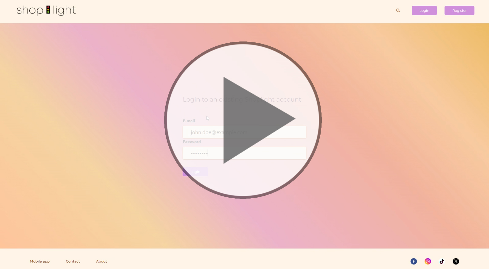

# Shop-Light 🚦
Shoplight is a community marketplace app focused on connecting users wishing to buy and sell items. Connect with people in your area and across nearby neighbourhoods and check out whats available 

## Typical User Experience
A user can sign up for an account and browse items that have been listed by other users within their local community, or neighbouring regions. If a user has an item they would like to sell they can also create listings of their own. 

Often users will reach out and message each other for offers or discussions regarding listed items. Typically after a back and forth messaging interaction, the two parties can meet and exchange the item in person for the agreed upon price. When a transaction has completed, the original listing poster can mark their item as sold.

## Functionality checklist
Shoplight has a list of core features available to logged-in users:

- Browsing Listings
- Filtering Listings by price `'Low to high'` and `'High to low'`
- Searching listings by `'Keyword'`, `'Minimum Price'`,  `'Maximum Price'`
- Favouriting listings
- Creating our own listing
- Marking our listings as `'Sold'`
- Messaging Users
- Viewing incoming messages
- Replying to other user's messages

##  User Data Safety Precautions
In order to maintain safe handling and storage of our users data, we have taken precautions and implemented:

- Session based cookies
- Cookie Encryption
- Password Encryption
- Cross Site Scripting (XSS) Prevention
- SQL Injection Prevention

## Getting Started
1. Create the `.env` by using `.env.example` as a reference: `cp .env.example .env`
2. Update the .env file with your correct local information 
-  DB_HOST= `localhost`
-  DB_USER= `insert_your_username`
-  DB_PASS= `insert_your_password`
-  DB_NAME= `insert_your_database_name`
-  DB_PORT= `5432`
3. Install dependencies: `npm i`
4. Fix to binaries for sass: `npm rebuild node-sass`
5. Reset database: `npm run db:reset`. Check the db folder to see what gets created and seeded in the DB
7. Run the server with the command: `npm run local`.
8. Visit `http://localhost:8080/`

## Dependencies
- Node 10.x or above
- NPM 5.x or above
- PG 8.5.0 or above
- Node 10.x or above
- NPM 5.x or above
- Bcryptjs 2.4.3 or above
- Chalk 2.4.2 or above
- Cookie-session 2.1.0 or above
- Dotenv 2.0.0 or above
- EJS 2.6.2 or above
- Express 4.17.1 or above
- Morgan 1.9.1 or above 
- SASS 1.35.1 or above

Nodemon 2.0.10 as a dev dependency

## Our Team
Cynthia Lam - https://github.com/cynthia-lam  
Lubi Islam - https://github.com/lubi25  
Christopher Pytel - https://github.com/ChrisPytel 

## Shoplight in Action
Below are a few clips to demonstrate how Shop-light looks and behaves for an end user. Click an image to see each functionality being showcased.

### Landing page

### Saving Favourite Listings

### Featured Section and Sending Messages

### Back and Forth Messaging Between Two Users

### Viewing All Listings and Price Sorting

### Creating a New Listing

### Search Function

### Login Credential Verification
